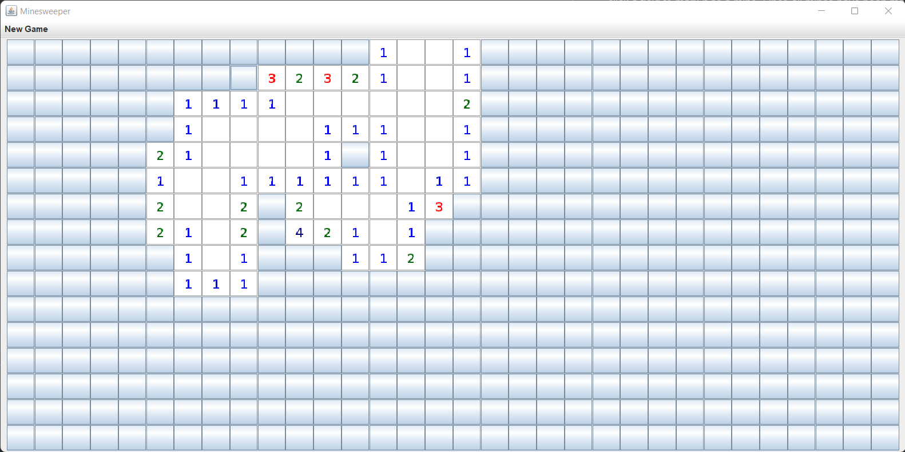
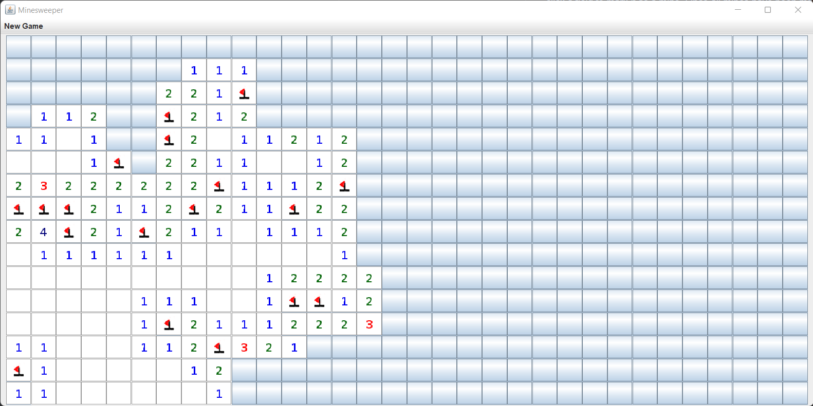

# Minesweeper
This repository contains a simple Java implementation of the game Minesweeper. 
Left-click a field to reveal it, right-click a field to mark it as a mine. 
Once all mines have been marked as one and the remaining fields have been revealed, the game is won.
Left-clicking on a mine ends the game.

## Playing

