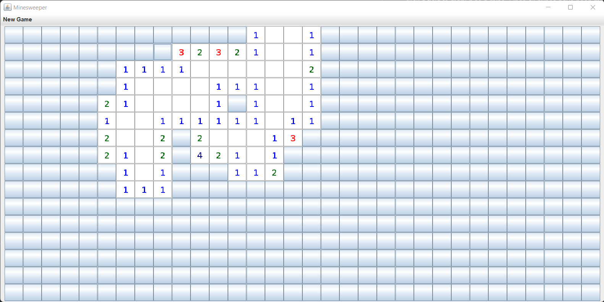
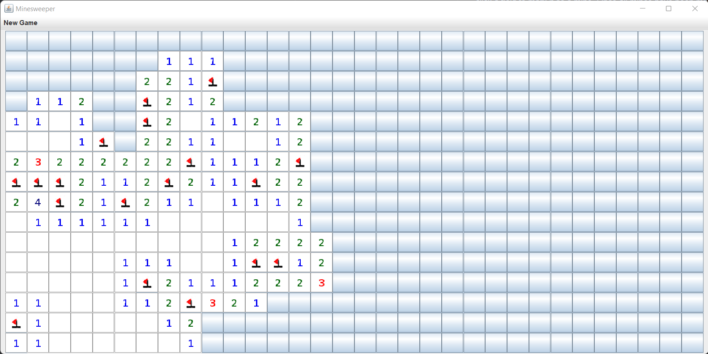

# Minesweeper
This repository contains a simple Java implementation of the game [Minesweeper](https://en.wikipedia.org/wiki/Minesweeper_(video_game)).

Left-click a field to reveal it, right-click a field to mark it as a mine. 
Once all mines have been marked as such and the remaining fields have been revealed, the game is won.
Left-clicking on a mine ends the game.

To play, download the latest jar (e.g. `minesweeper-v1.0.jar`) from the packages on the right and execute it.
Make sure to have Java 17 or higher installed.

## Background
This Java implementation was originally a project I did in my 11th grade computer science class.
Since then, I have been improving its code structure from time to time (although still keeping the same old GUI).
